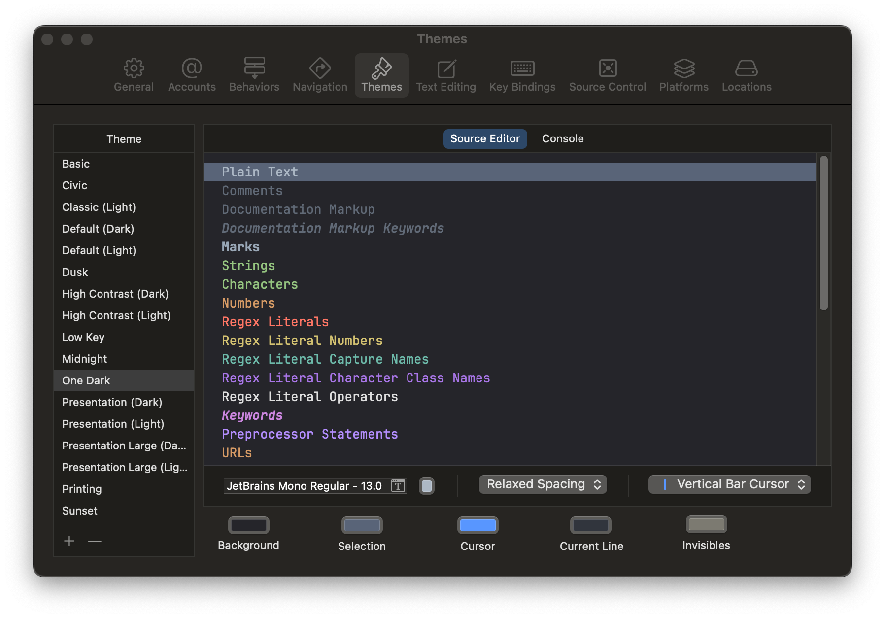

# One Dark theme for Xcode 15

This is a port of the original [Atom One Dark](https://github.com/atom/one-dark-syntax) theme for Xcode.

The new theme is modified based on [bojan/xcode-one-dark](https://github.com/bojan/xcode-one-dark).

## Installation

You can install the theme by downloading `One Dark.xccolortheme` and copying it to:

	~/Library/Developer/Xcode/UserData/FontAndColorThemes

Note: If the folder doesn't exist, create it manually.

The theme uses the excellent open-source font [JetBrains Mono](https://www.jetbrains.com/lp/mono/).

## Screenshots

    

